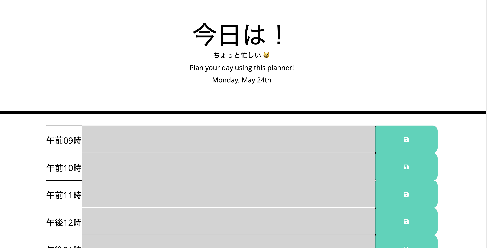

# 5_homework

This homework was to create a planner using third-party APIs that logs input from the user and is saved to local storage. 

  This application started with beginner code in HTML and CSS.  

  A link to the website: https://jminaga.github.io/05_homework_planner/index.html  

  Shown below is an image of the finished product  

